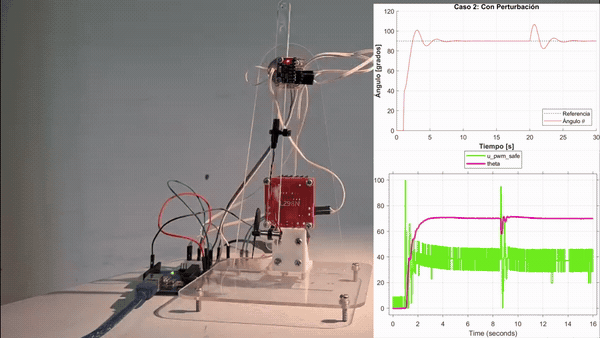
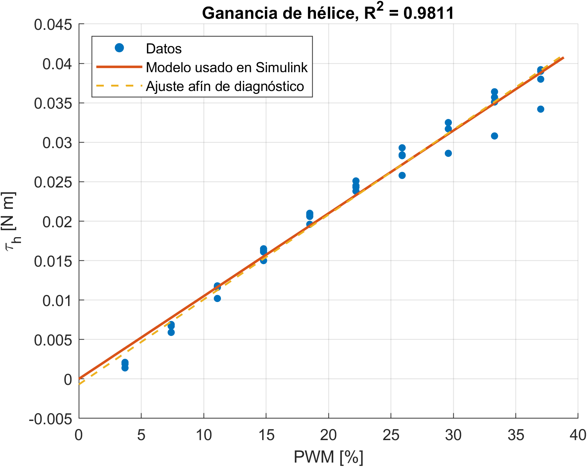
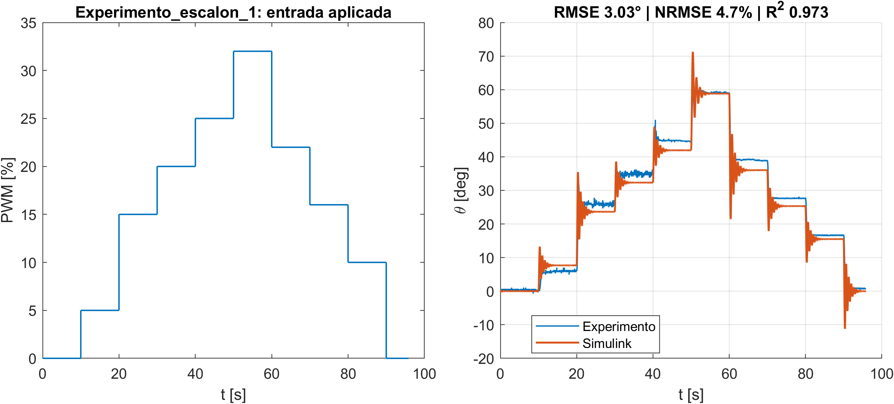
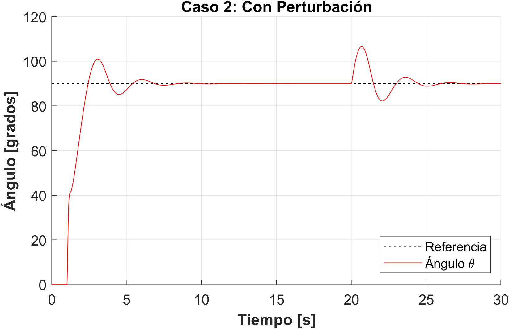
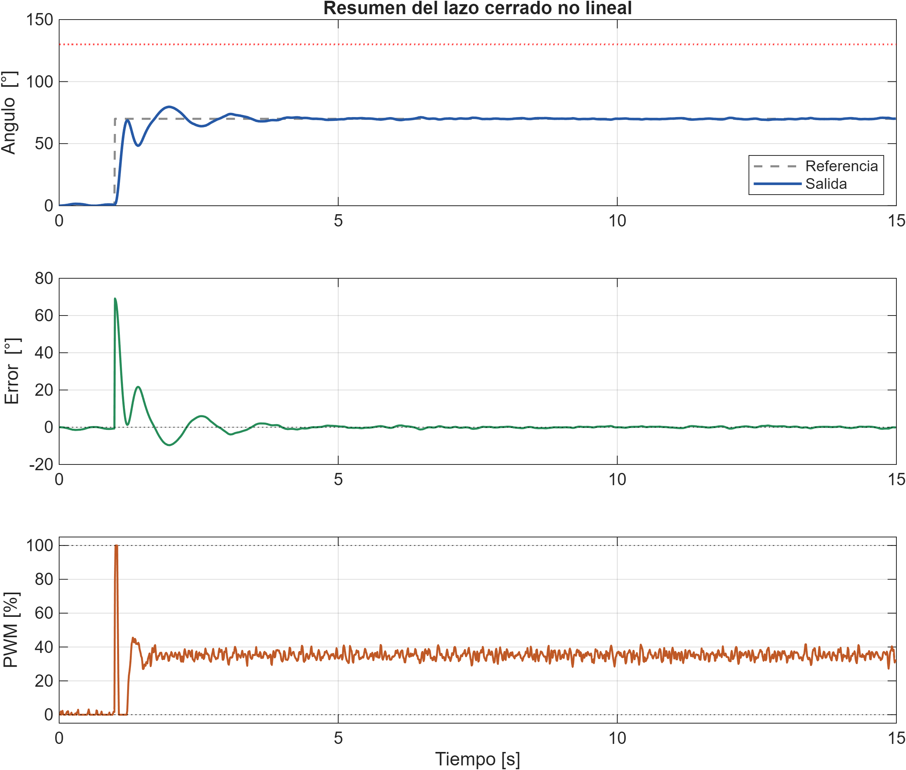
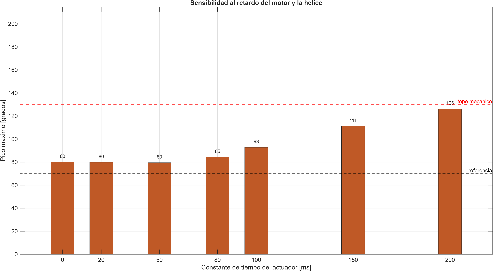
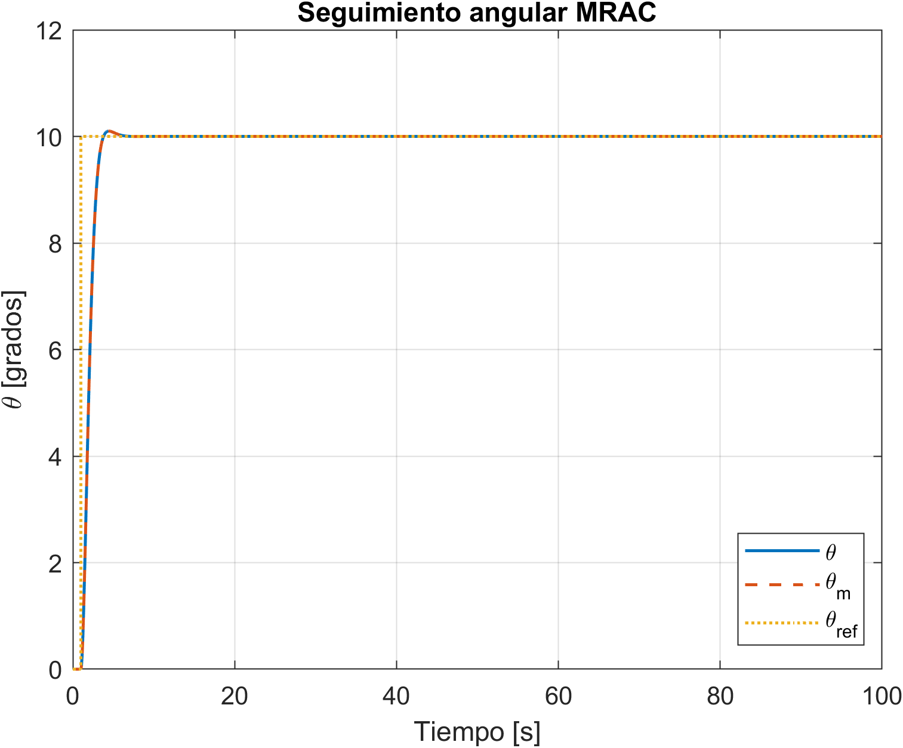
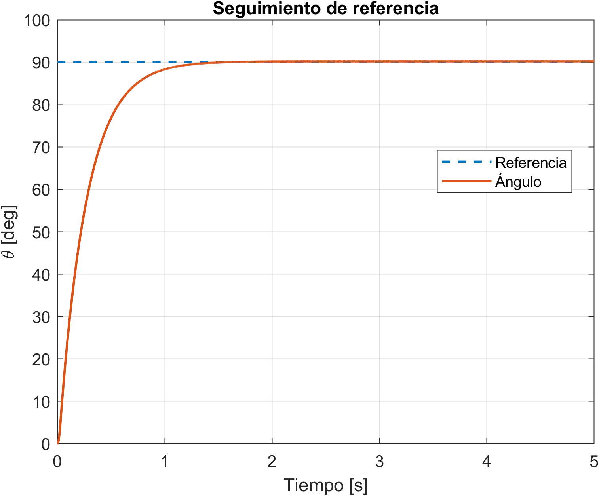
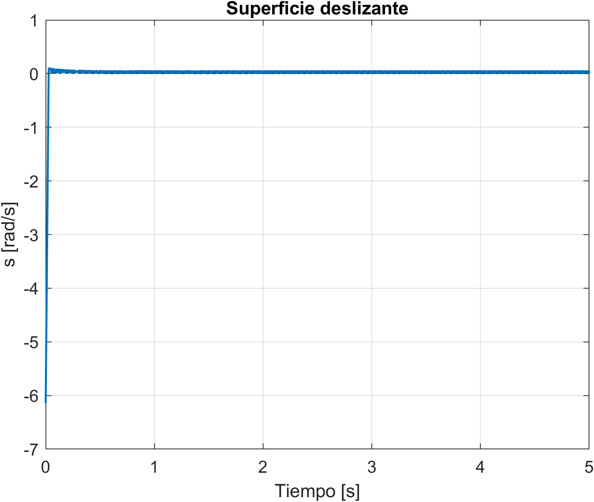

# Aeropendulum — Identification and four control laws on real hardware

> **FR —** Pendule actionné par une hélice : identification expérimentale, modèle non linéaire validé sous Simulink, puis quatre lois de commande (PID, H∞, MRAC, mode glissant) déployées sur la maquette réelle.
>
> **ES —** Péndulo accionado por hélice: identificación experimental, modelo no lineal validado en Simulink y cuatro leyes de control (PID, H∞, MRAC, modo deslizante) implementadas en la planta real.

<p align="center">
  
</p>

A bar pivots on an acrylic frame; a DC motor with a propeller at its tip produces the thrust that lifts it. The goal is to hold the bar at a chosen angle and reject disturbances. The plant is nonlinear (gravity torque ∝ sin θ), has an actuator dead zone and saturates near the vertical, which makes it a good bench for comparing controllers.

| | |
|---|---|
| **Hardware** | Acrylic frame, DC motor + propeller, angle sensor on the pivot, L298N H-bridge, Arduino (12-bit PWM, Ts = 10 ms) |
| **Model** | `J θ̈ = K·u − b θ̇ − Mgl sin θ` identified from quasi-static, free-oscillation and step tests |
| **Validation** | Nonlinear Simulink model vs. three step experiments: **R² = 0.943, RMSE = 3.37°** on average |
| **Controllers** | PID (firmware), H∞ mixed sensitivity, MRAC and sliding mode (Simulink → Arduino) |

---

## 1. Identification

Three kinds of experiments give the physical parameters:

- **Quasi-static tests**: constant PWM levels, wait for equilibrium, least squares on `K·u_eq = Mgl sin θ_eq` → propeller gain, gravity torque and dead zone.
- **Free oscillations** with the motor off: logarithmic decrement of the peaks → inertia `J` and viscous friction `b`.
- **Step tests** to validate the full nonlinear model in Simulink.

| Parameter | Value | Unit |
|---|---|---|
| Mgl | 3.924 × 10⁻² | N·m |
| K (torque per % PWM) | 1.049 × 10⁻³ | N·m / %PWM |
| Dead zone | 0.649 | %PWM |
| J | 4.286 × 10⁻⁴ | kg·m² |
| b | 8.303 × 10⁻⁴ | N·m·s/rad |

<p align="center">
  
  
</p>

| Validation experiment | RMSE [°] | NRMSE [%] | R² |
|---|---|---|---|
| Step 1 | 3.03 | 4.70 | 0.973 |
| Step 2 | 4.49 | 5.74 | 0.958 |
| Step 3 | 2.59 | 5.79 | 0.898 |
| **Average** | **3.37** | **5.41** | **0.943** |

Linearised around θ₀ = 70°, with u in %PWM and θ in degrees:

$$ G(s) = \frac{140.3}{s^2 + 1.937\,s + 31.32} $$

## 2. Controllers

### PID
Designed on the linear model by root locus (Kp, then Ki, then Kd with a derivative filter N = 100), then tuned on the bench and implemented directly in the firmware ([`firmware/Codigo_ESP`](firmware/Codigo_ESP/Codigo_ESP.ino)) with saturation and a 90° reference.

<p align="center"></p>

### H∞ (mixed sensitivity)
Weights on S, T and KS shape the loop; the controller is simulated on the nonlinear plant ([`Simulacion_Hinf.m`](matlab/Simulacion_Hinf.m)) and deployed to the Arduino from Simulink ([`Hinf_Arduino.slx`](matlab/Hinf_Arduino.slx)). The study includes Bode/Nyquist margins and robustness sweeps over sampling time, actuator delay and parameter errors.

<p align="center">
  
  
</p>

### MRAC
Model-reference adaptive control: the adaptive gains Kx and Kr converge online so the bar follows a reference model ([`MRAC_proyecto_Arduino.slx`](matlab/MRAC_proyecto_Arduino.slx)).

### Sliding mode (SMC)
A sliding surface on the angle error drives the state to the surface and keeps it there despite model errors ([`SMC_Arduino.slx`](matlab/SMC_Arduino.slx), equivalent-control variant in `SMC_equiv.slx`).

<p align="center">
  
  
  
</p>

## 3. Videos on the real bench

| Controller | Video |
|---|---|
| Comparison of the controllers | [Desempeno_comparativo.mp4](docs/media/Desempeno_comparativo.mp4) |
| PID | [PID.mp4](docs/media/PID.mp4) |
| H∞ | [Hinf.mp4](docs/media/Hinf.mp4) |
| MRAC | [MRAC.mp4](docs/media/MRAC.mp4) |
| Sliding mode | [SMC.mp4](docs/media/SMC.mp4) |

## Repository layout

```
firmware/Codigo_ESP/     Arduino firmware with the discrete PID (12-bit PWM, 10 ms)
matlab/
  proyecto.mlx                       Identification, Simulink validation and PID design
  coeficiente_friccion.mlx           Free-oscillation analysis (J and b)
  Experimentos.xlsx                  Raw experimental data
  modelo_protyecot.slx, lazo_cerrado.slx   Nonlinear plant and closed loop
  H_infinito.mlx, Simulacion_Hinf.m, Hinf_Arduino.slx
  MRAC_proyecto.slx, MRAC_proyecto_Arduino.slx, configuracion_MRAC_Arduino.mlx
  SMC.slx, SMC_Arduino.slx, SMC_equiv.slx
docs/
  Informe_identificacion_y_PID.pdf   Report: identification, validation and PID design
  H_infinito_diseno.pdf              H∞ design notebook (export)
  figuras/                           All figures (PNG + PDF): identification/PID, H∞, MRAC, SMC
  media/                             Videos of each controller on the bench
```

Open `matlab/` as the MATLAB current folder so the scripts find the data and the models. The `*_Arduino.slx` models need the *Simulink Support Package for Arduino Hardware*.

## Team

Juan Manuel Beltrán Botello · Nicolás Plata Molano · Oscar Jhonadairo Siabato León · Sergio Andrés Bolaños Penagos

*Técnicas de Control, Facultad de Ingeniería, Universidad Nacional de Colombia, 2026.*
